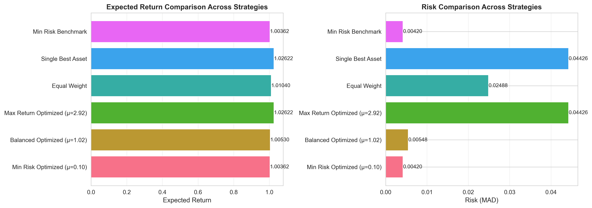

# Portfolio Selection 投资组合优化 - PPT演示大纲

**总时长：15分钟**

---

## 幻灯片1：封面 (30秒)
- **标题**：基于线性规划的投资组合优化
- **副标题**：Portfolio Selection using Linear Programming
- **内容**：
  - 课程：线性规划及应用
  - 参考教材：Vanderbei 第13章
  - 日期：2025年10月

---

## 幻灯片2：问题背景 (1分钟)
- **投资组合选择问题**
  - 如何在多个资产中分配资金？
  - 目标：在控制风险的前提下最大化收益
  
- **经典难题**
  - 高收益往往伴随高风险
  - 需要在收益和风险之间权衡
  - Markowitz（1952）提出现代投资组合理论

- **本项目创新点**
  - 使用MAD（均值绝对偏差）代替方差作为风险度量
  - 将问题转化为线性规划模型
  - 真实市场数据验证

---

## 幻灯片3：数学模型 - 问题定义 (2分钟)

### 符号定义
- n = 9 个资产（ETF）
- T = 36 个月
- $R_j(t)$: 资产j在时期t的收益率
- $r_j = \frac{1}{T}\sum_{t=1}^T R_j(t)$: 期望收益
- $x_j$: 资产j的配置比例（决策变量）

### 风险度量：MAD
$$\text{Risk} = \mathbb{E}|R - \mathbb{E}R| = \frac{1}{T}\sum_{t=1}^T \left|\sum_{j=1}^n x_j(R_j(t) - r_j)\right|$$

### 为什么选择MAD？
- ✅ 可以转化为线性约束
- ✅ 保持问题的线性规划性质
- ✅ 对极端值更鲁棒
- ✅ 计算效率高

---

## 幻灯片4：线性规划模型 (2分钟)

### 目标函数
$$\max \quad \mu \sum_{j=1}^n x_j r_j - \frac{1}{T}\sum_{t=1}^T y_t$$

### 约束条件
$$\begin{aligned}
&-y_t \leq \sum_{j=1}^n x_j(R_j(t) - r_j) \leq y_t, \quad \forall t \\
&\sum_{j=1}^n x_j = 1 \\
&x_j \geq 0, \quad \forall j \\
&y_t \geq 0, \quad \forall t
\end{aligned}$$

### 参数说明
- **μ（风险厌恶参数）**：平衡收益和风险的权重
  - μ → 0：极度保守，最小化风险
  - μ → ∞：极度激进，最大化收益
  - μ ≈ 1：平衡型投资

---

## 幻灯片5：数据来源 (1分钟)

### 投资标的（9个ETF）
| 代码 | 名称 | 年化收益率 | 年化波动率 |
|------|------|-----------|-----------|
| SHY | 短期国债 | 4.44% | 1.91% |
| XLB | 材料 | 10.17% | 17.95% |
| XLE | 能源 | 4.05% | 17.51% |
| XLF | 金融 | 19.49% | 16.53% |
| XLI | 工业 | 21.17% | 15.63% |
| **XLK** | **科技** | **36.42%** | **18.81%** |
| XLP | 日常消费品 | 5.92% | 10.88% |
| XLU | 公用事业 | 15.22% | 14.92% |
| XLV | 医疗保健 | 5.65% | 12.84% |

- **数据源**：Yahoo Finance
- **时间范围**：2022年11月 - 2025年10月（36个月）
- **频率**：月度

---

## 幻灯片6：求解方法 (1.5分钟)

### 求解器选择
- **PuLP** + **CBC求解器**
  - Python建模框架
  - 开源免费
  - 高效稳定

### 参数化求解策略
```python
# 使用对数刻度生成30个μ值
mu_values = np.logspace(-1, 1.5, 30)  # [0.1, ..., 31.6]

# 对每个μ值独立求解
for mu in mu_values:
    solve_portfolio_optimization(mu)
```

### 求解效率
- 单个问题求解时间：< 0.1秒
- 30个问题总时间：< 3秒
- 问题规模：
  - 变量数：9 + 36 = 45
  - 约束数：1 + 72 = 73

---

## 幻灯片7：代码演示 (2分钟)

### 核心代码结构
```python
# 1. 数据获取
fetcher = DataFetcher()
returns_data = fetcher.fetch_data()

# 2. 构建优化器
optimizer = PortfolioOptimizer(returns_data)

# 3. 参数化求解
results_df = optimizer.solve_parametric(mu_values)

# 4. 可视化
visualizer = PortfolioVisualizer(results_df)
visualizer.plot_all()
```

### 实际运行演示
- 展示终端输出
- 展示生成的文件结构

---

## 幻灯片8：结果分析 - 有效前沿 (2分钟)

### 有效前沿图


### 关键发现
1. **最小风险组合**（μ=0.1）
   - 收益：0.36% /月
   - 风险：0.42%
   - 配置：99.2% SHY + 0.8% XLE

2. **平衡组合**（μ≈1）
   - 收益：0.54% /月
   - 风险：0.56%
   - 配置：90.4% SHY + 8.0% XLK + 1.6% XLE

3. **最大收益组合**（μ=2.9）
   - 收益：2.62% /月
   - 风险：4.43%
   - 配置：100% XLK（科技板块）

---

## 幻灯片9：结果分析 - 资产配置演化 (1.5分钟)

### 权重演化图


### 观察
- **μ < 0.5**：以国债SHY为主（低风险）
- **0.5 < μ < 2**：开始配置XLK（科技）和其他高收益资产
- **μ > 2**：全部配置XLK（追求最大收益）

### 启示
- 多元化效应主要在中等风险厌恶水平显现
- 极端保守或极端激进时趋向单一资产

---

## 幻灯片10：结果分析 - 参数敏感性 (1分钟)

### 参数μ影响图


### 三个维度分析
1. **期望收益**
   - 随μ增加而单调递增
   - μ > 2后趋于平稳（达到最优资产）

2. **风险（MAD）**
   - 随μ增加而增加
   - 呈现非线性增长

3. **目标函数值**
   - 综合反映风险调整后的收益
   - μ越大，值越大（因为μ是权重）

---

## 幻灯片11：策略对比 (1.5分钟)

### 策略对比图


### 夏普比率对比
| 策略 | 收益 | 风险 | 夏普比率 |
|------|------|------|---------|
| 最小风险优化 | 0.36% | 0.42% | **238.91** |
| 平衡优化 | 0.54% | 0.56% | **179.18** |
| 等权重 | 1.04% | 2.49% | 40.61 |
| 最大收益优化 | 2.62% | 4.43% | 23.19 |
| 单一最优资产 | 2.62% | 4.43% | 23.19 |

### 结论
- ✅ 优化策略显著优于简单策略
- ✅ 低风险组合的夏普比率最高
- ✅ 多元化在中等风险水平效果最佳

---

## 幻灯片12：主要结论 (1分钟)

### 1. 模型有效性
- ✅ 成功将Portfolio Selection转化为LP问题
- ✅ 求解高效，可扩展性强
- ✅ 结果符合金融理论预期

### 2. 有效前沿特征
- 清晰的风险-收益权衡曲线
- 任何不在有效前沿上的组合都可改进

### 3. 多元化效应
- 通过分散投资降低风险
- 在相同收益水平下风险更低

### 4. 参数μ的实践意义
- **保守型**（μ < 1）：重视资本保全
- **平衡型**（1 ≤ μ ≤ 3）：追求稳健增长
- **激进型**（μ > 3）：追求高回报

---

## 幻灯片13：技术亮点与创新 (1分钟)

### 技术实现亮点
1. **真实数据获取**
   - 自动从Yahoo Finance下载
   - 智能限流保护（2.5秒延时）
   - 数据质量检查

2. **模块化设计**
   - 数据层、模型层、可视化层分离
   - 易于扩展和维护

3. **全自动化流程**
   - 一键运行完整分析
   - 自动生成报告和图表

4. **丰富的可视化**
   - 5种专业图表
   - 高分辨率输出（300 DPI）

---

## 幻灯片14：遇到的问题与解决 (1分钟)

### 主要挑战

1. **yfinance API变更**
   - 问题：`Adj Close`列访问失败
   - 解决：兼容MultiIndex和单列索引

2. **中文字体显示**
   - 问题：图表中文字符缺失
   - 解决：配置字体回退列表

3. **数据限流风险**
   - 问题：频繁请求可能被封禁
   - 解决：添加2.5秒延时机制

4. **模型求解效率**
   - 问题：30个问题是否需要很长时间
   - 解决：CBC求解器高效，总计<3秒

---

## 幻灯片15：总结与展望 (1分钟)

### 项目总结
✅ **完成目标**
- 完整实现教材13章Portfolio Selection模型
- 真实数据验证模型有效性
- 生成专业分析报告和可视化

✅ **学习收获**
- 深入理解线性规划在金融中的应用
- 掌握PuLP建模技巧
- 提升Python工程实践能力

### 未来改进方向
1. 加入交易成本约束
2. 实现滚动窗口回测
3. 比较不同风险度量（方差 vs MAD vs CVaR）
4. 引入更多约束（行业限制、持仓上下限）
5. 实时数据更新和监控

---

## 幻灯片16：致谢 (10秒)
- 感谢老师指导
- 感谢课程组提供学习资源
- 谢谢观看！


